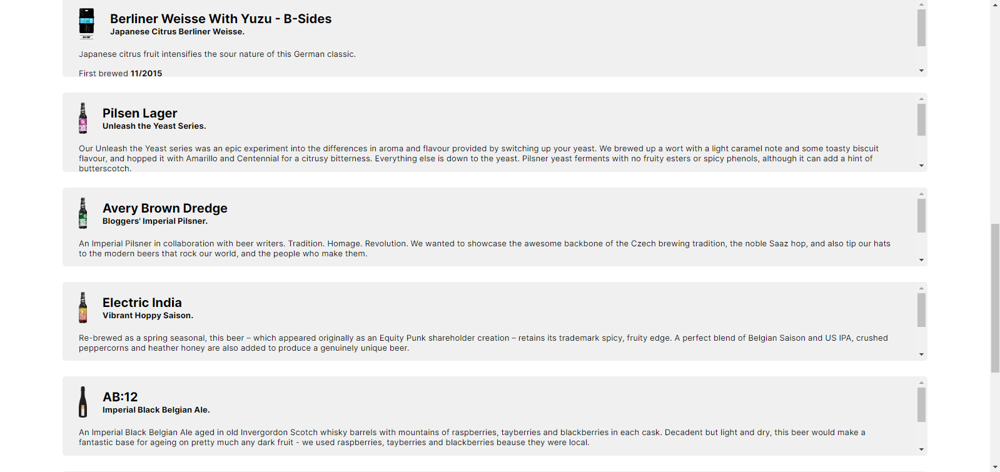
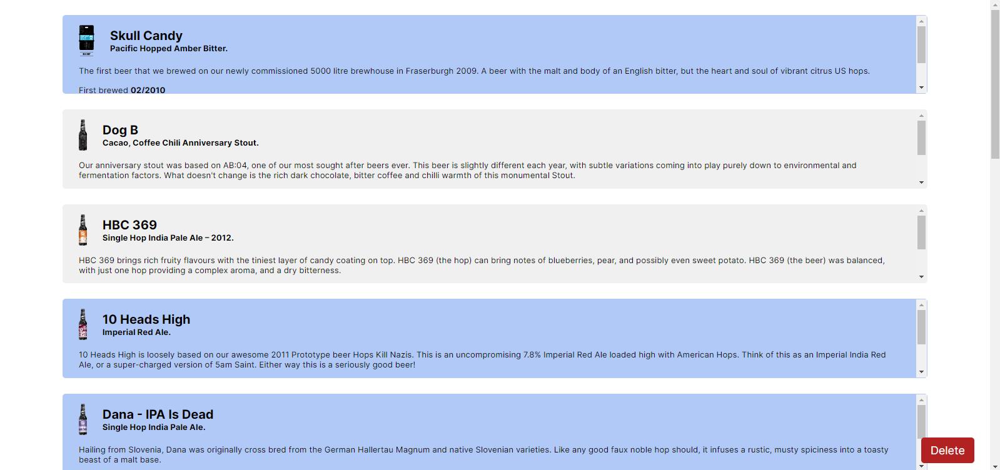
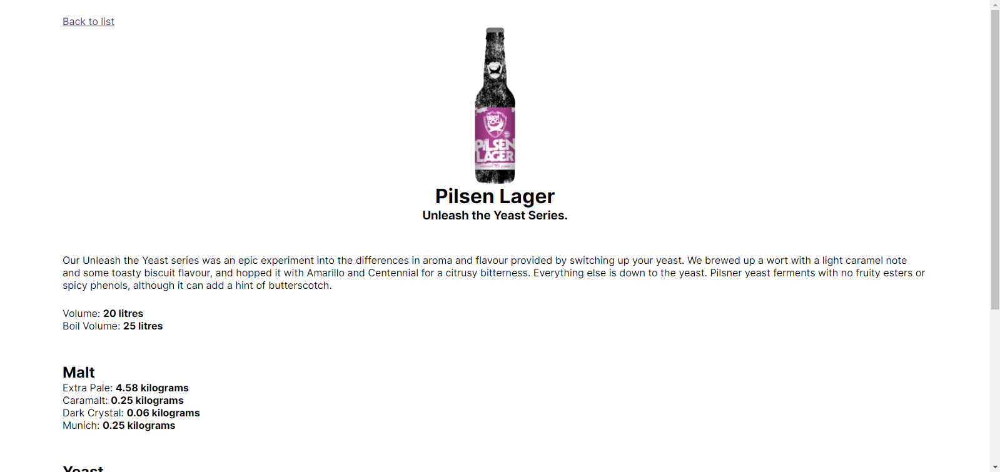

# Beer Land (Test Task)

## How to run

```bash
$ yarn
$ yarn dev
```

## Technologies

- On Frontend **(TypeScript)**
  - [Vite](https://vitejs.dev)
  - [React](https://react.dev)
  - [React Router](https://reactrouter.com)
  - [Axios](https://axios-http.com)
  - [zustand](https://github.com/pmndrs/zustand)
  - [Sass](https://sass-lang.com)

# 

# 


